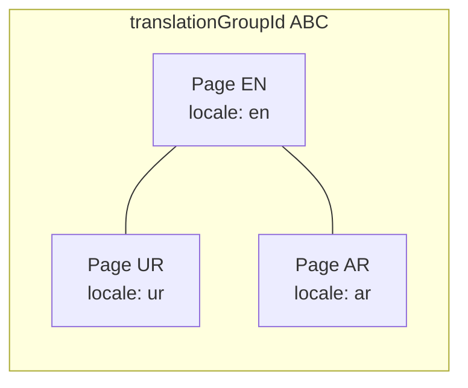
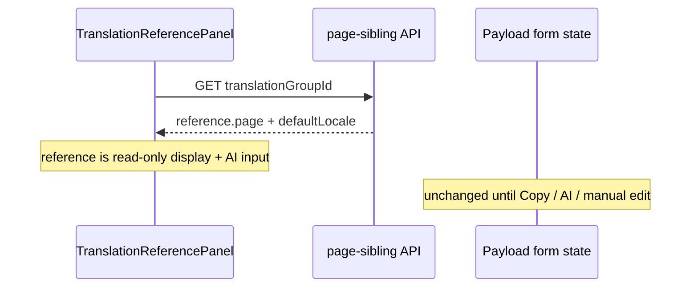
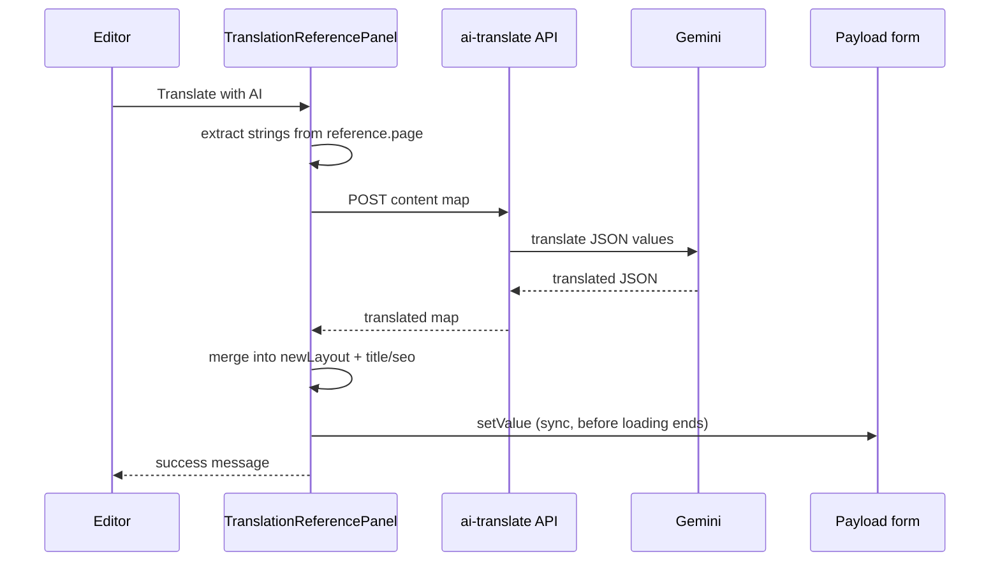
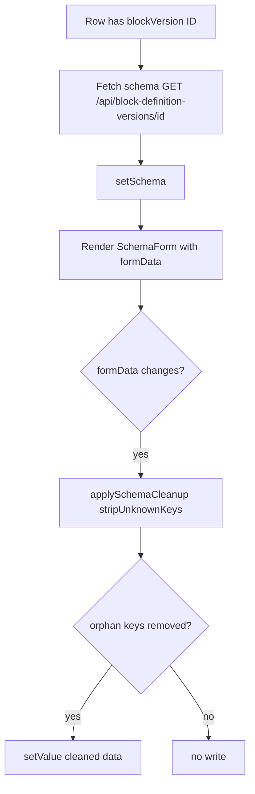

# Page Translation Workflow

This document describes how locale pages, block copying, AI translation, and saving work in this Payload CMS project. It is intended for editors and developers debugging issues such as translations appearing briefly then reverting to English.

---

## 1. Architecture overview

This project does **not** use Payload’s built-in collection `localization`. Each language is a **separate `pages` document** linked by a shared `translationGroupId`.

| Concept | Meaning |
|--------|---------|
| **Default locale page** | The source-language page (e.g. English). Content is authored here first. |
| **Translation page** | Another `pages` row with the same `translationGroupId` but a different `locale` relationship. |
| **translationGroupId** | UUID generated on create (`beforeChange` hook). All locale variants of the same logical page share this ID. |
| **dbLayout** | Page Builder array: block type, schema version, and JSON `data` per block. |
| **contentBlocks** | Payload native `blocks` field (e.g. Testimonials). |



**Implication:** Switching language in the admin does not change fields on the same document—it **navigates** to a different document (`PageLocaleField`).

---

## 2. Admin UI components (sidebar)

On a **non-default** locale page edit screen, the sidebar includes:

| UI field | Component | Role |
|----------|-----------|------|
| Locale | `PageLocaleField` | Switch between sibling pages (warns if form is modified). |
| Translation status | `TranslationStatus` | Shows group / sibling status. |
| Duplicate for locale | `DuplicateForLocale` | Create a new locale page from an existing one. |
| **Translate Content** | `TranslationReferencePanel` | Reference source text, copy blocks, manual + AI translation. |

The main document form still has the full **Page Builder** (`dbLayout`) with `BlockDataField` on each row’s `data` JSON field.

---

## 3. Recommended editor workflow

Use this order to avoid empty blocks and reverts:

1. **Create or open the translation page**  
   - Default locale: edit source content.  
   - Other locales: use **Duplicate for locale** or open an existing sibling.

2. **Save once** so `translationGroupId` exists and the translation panel loads.

3. **Copy blocks from source** (sidebar → *Copy Blocks from Source*)  
   - Copies structure and English text into the form.  
   - Does **not** write to the database until you click **Save**.

4. **Translate** (choose one or combine):  
   - **Translate with AI** — bulk draft for title, SEO, and block strings.  
   - **Block Content Translation** inputs — per-field overrides in the sidebar.  
   - **Page Builder** (main area) — edit `BlockDataField` / schema form directly.

5. **Review** in the main Page Builder and sidebar for ~10 seconds before saving (see §7).

6. **Save** the page once. Wait for Submitting to finish.

7. **Optional:** Publish / preview after save.

---

## 4. Creating a translation page

### 4.1 Duplicate for locale

**UI:** Sidebar → *Translate to…* (`DuplicateForLocale`)  
**API:** `POST /api/admin/duplicate-page-locale`  
**Logic:** `src/lib/admin/duplicatePageForLocale.ts`

- Loads source page (`depth: 0`).
- Creates a new `pages` document with same `translationGroupId`, new `locale`, sanitized copy of fields.
- Returns `{ pageId, slug }`; client navigates to the new edit URL.

### 4.2 Locale switcher (existing translation)

**UI:** Sidebar → Locale dropdown (`PageLocaleField`)  
**Behavior:** Navigates to sibling URL; prompts if the current form has unsaved changes.

---

## 5. Loading source reference content

When `translationGroupId` is set, `TranslationReferencePanel` loads the default-locale sibling:

**API:** `GET /api/admin/page-sibling?translationGroupId={uuid}`  
**File:** `src/app/api/admin/page-sibling/route.ts`

**Response (simplified):**

```json
{
  "page": {
    "id": 1,
    "title": "...",
    "slug": "...",
    "seo": { "metaTitle": "...", "metaDescription": "..." },
    "dbLayout": [ /* depth: 2 — relationships populated as objects */ ],
    "contentBlocks": []
  },
  "defaultLocale": { "id": 1, "code": "en", "name": "English", "flag": "..." }
}
```

**Important:** `dbLayout` is fetched with **`depth: 2`**, so `blockDefinition` and `blockVersion` arrive as **full objects** `{ id, name, ... }`, not plain numeric IDs.

This reference is stored in React state (`reference`) and is used for:

- Displaying source (English) text in the sidebar.
- Collecting strings for AI translate.
- Fallback structure when copying/translating blocks.

It does **not** automatically sync into the form; only explicit actions below update form state.



---

## 6. Copy blocks from default

**UI:** Sidebar → *Copy Blocks from Source* (with confirmation)  
**Handler:** `doCopyBlocks` in `TranslationReferencePanel.tsx`  
**API:** `POST /api/admin/copy-blocks-from-default` with `{ pageId, dryRun: true }`  
**File:** `src/app/api/admin/copy-blocks-from-default/route.ts`

### 6.1 What the API does

1. Loads the **current** (target) page and finds the default-locale sibling by `translationGroupId`.
2. Builds a new `dbLayout` array:
   - `blockDefinition` / `blockVersion` → **numeric IDs** via `coerceRelationshipId`
   - `data` → `normalizeBlockData(block.data)`
   - New `instanceId` per row (or preserved from source)
3. If `dryRun: true` (always used from the panel): returns blocks JSON **without** `payload.update`.
4. If `dryRun: false`: writes directly to the database.

### 6.2 What the panel does

```ts
dbLayoutField.setValue(data.blocks.dbLayout)
```

- Updates **in-memory form only**.
- User must click **Save** to persist.

### 6.3 Why `dryRun: true`

So copy does not fight unsaved edits or auto-save; the editor controls when data is written via **Save**.

---

## 7. AI translation (“Translate with AI”)

**UI:** Sidebar → *Translate with AI*  
**Handler:** `doAiTranslate` in `TranslationReferencePanel.tsx`  
**API:** `POST /api/admin/ai-translate`  
**File:** `src/app/api/admin/ai-translate/route.ts`  
**External:** Google Gemini 2.5 Flash (`GEMINI_API_KEY`)

### 7.1 Step-by-step (client)

| Step | Action |
|------|--------|
| 1 | Read **source** from `reference.page` (default locale sibling), not from the current form. |
| 2 | Build `content` map: `title`, `seo.metaTitle`, `seo.metaDescription`, plus block keys `__block_{index}__{path}`. |
| 3 | Extract block strings with `extractAllStrings()` on each block’s `data` (paths use ` › ` separators, e.g. `paragraphs › 0 › text`). |
| 4 | POST to `/api/admin/ai-translate` with `sourceLocale`, `targetLocale`, `content`. |
| 5 | Receive `translated: Record<string, string>` (same keys). |
| 6 | Build `newLayout` and apply translations (see §7.2). |
| 7 | `setValue` on form: `title`, `seo.*`, `dbLayout` **before** `setAiTranslating(false)`. |

**Slug is not auto-translated.**

### 7.2 Building `newLayout` after AI

Current logic (post-fix):

1. If the form already has `dbLayout` rows → **normalize existing rows** (`normalizeDbLayoutRow`) and keep row metadata.
2. If the form has no blocks → map from source via `mapSourceBlockToRow`.
3. For each block index with translations:
   - Clone **source** `data` structure (`normalizeBlockData` + deep clone).
   - `setValueByPath(data, path, translatedValue)` for each AI key.
   - Assign `data` back to that row.

Relationship IDs are coerced with `extractRelId` / `coerceRelationshipId` so the form stores **plain IDs**, not depth-2 objects.

### 7.3 AI API (server)

| Input | Output |
|-------|--------|
| `sourceLocale`, `targetLocale` (code or ID) | Resolved to locale names from `locales` collection |
| `content: { key: sourceText }` | `translated: { key: targetText }` |

Gemini is called with `responseMimeType: application/json`. Keys in the response must match the request keys.



---

## 8. Manual translation (sidebar)

### 8.1 Page-level rows

`TranslationRow` binds to the same Payload paths as the main form:

| Label | Form path |
|-------|-----------|
| Title | `title` |
| Slug | `slug` |
| Meta Title | `seo.metaTitle` |
| Meta Description | `seo.metaDescription` |

Top box = source (from `reference.page`). Bottom input = `useField` → `setValue` on change.

### 8.2 Block content translation

`BlockTranslationSection`:

- Reads strings from **source** `reference.page.dbLayout`.
- Reads/writes **target** via `dbLayoutField.value` and `onTargetChange` → `dbLayoutField.setValue`.
- Shows first 6 fields by default (*Show more* for the rest).
- On edit: clones source `data` if target block `data` is empty, then `setValueByPath`.

**Same underlying field as Page Builder** — two UIs can both update `dbLayout`.

---

## 9. Main Page Builder (`BlockDataField`)

Each `dbLayout` row has a custom **`data`** field:

**Component:** `src/components/BlockDataField/index.tsx`  
**Rendered as:** Schema-driven form (`SchemaForm`) from `block-definition-versions` API.

### 9.1 Lifecycle



### 9.2 Interaction with AI translate

When `dbLayoutField.setValue(newLayout)` runs:

1. Every row’s `BlockDataField` may re-render or remount.
2. Schema fetch takes ~**1 second** per block.
3. **`applySchemaCleanup`** runs when `formData` + `schema` are ready (hydration effect).

**Historical bug:** Cleanup ran immediately when the schema fetch finished, using a **stale** `formDataRef` (pre-translation English). That overwrote AI translations after ~1s.

**Current mitigation:** Cleanup is **not** called in the schema fetch callback; only in the `formData` hydration effect after data is in the form.

**Remaining risk:** If `stripUnknownKeys` removes keys that exist in `data` but not in the schema’s top-level field list, translated nested values could still be altered. Edits should use schema field names.

---

## 10. Saving the page

**UI:** Top bar → **Save**  
**Mechanism:** Payload admin document form → `PATCH` / `POST` to `pages` collection.

### 10.1 `beforeChange` hook (`Pages` collection)

**File:** `src/collections/Pages.ts`

On every save:

1. Normalize `slug`.
2. Coerce `locale` relationship ID.
3. Auto-generate `translationGroupId` if missing (create).
4. For each `dbLayout` row: `normalizeBlockData(row.data)`.

**Note:** `blockDefinition` / `blockVersion` are **not** coerced in this hook (only `locale` is). Form state should already use plain IDs (copy-blocks and AI translate enforce this).

### 10.2 What gets persisted

Only what is in the **form state at Save time**. Nothing from `reference` (sibling API) is saved unless it was copied into the form via Copy / AI / manual edit.

### 10.3 Live preview and autosave

**File:** `src/components/LivePreviewListener.tsx`

- Payload can fire document events on **autosave**.
- Live preview refresh is debounced (1200ms) to avoid blocking save with heavy recompiles.
- Saving a large or malformed `dbLayout` (e.g. full relationship objects instead of IDs) can make Submitting hang or fail.

---

## 11. Why translations may not “stick”

| Symptom | Likely cause |
|---------|----------------|
| Translations show ~1s then revert to English | `BlockDataField` schema cleanup or remount overwrote `data`; or Save ran with old form state before `setValue` completed. |
| Sidebar shows translation, main Page Builder shows English | Two views on same `dbLayout`; one was updated, the other refreshed from stale row state. |
| Fields become empty | `setValueByPath` failed (missing nested structure); or cleanup stripped keys; or Save persisted empty blocks. |
| Save stuck on Submitting | Oversized payload (populated relationship objects); server error; live preview compile blocking admin API. |
| AI success but no block changes | No strings extracted (`length > 1` filter); or paths did not match `setValueByPath`; or `dbLayout` empty and copy not run first. |

### 11.1 Dual writers on `dbLayout`

These all call `dbLayoutField.setValue` (or per-row `data` setValue):

1. **Copy blocks** — full array from API (normalized IDs).
2. **AI translate** — merged array with translated `data`.
3. **BlockTranslationSection** — shallow copy + one path update.
4. **BlockDataField / SchemaForm** — per-field `handleChange` with `stripUnknownKeys`.

**Last writer wins** for the whole array or per-row `data`.

### 11.2 Timing checklist

- [ ] Run **Copy blocks** before AI if the translation page has no `dbLayout`.
- [ ] Wait for AI success message; wait **several seconds** before Save.
- [ ] Do not switch locale without saving (navigation loads another document).
- [ ] Avoid editing the same block in Page Builder and sidebar simultaneously right after AI.
- [ ] If Submitting hangs, check browser Network tab for failed `pages` request; reduce payload size (IDs not objects).

---

## 12. API reference

| Method | Path | Purpose |
|--------|------|---------|
| GET | `/api/admin/page-sibling?translationGroupId=` | Default-locale sibling for reference panel |
| POST | `/api/admin/copy-blocks-from-default` | Copy `dbLayout` + `contentBlocks` (`dryRun` optional) |
| POST | `/api/admin/ai-translate` | Gemini translation of string map |
| POST | `/api/admin/duplicate-page-locale` | Create new locale page |
| GET | `/api/block-definition-versions/{id}` | Schema for `BlockDataField` |

---

## 13. Key source files

| Area | Path |
|------|------|
| Pages collection + hooks | `src/collections/Pages.ts` |
| Translation sidebar | `src/components/admin/TranslationReferencePanel.tsx` |
| Locale navigation | `src/components/admin/PageLocaleField.tsx` |
| Duplicate locale UI | `src/components/admin/DuplicateForLocale.tsx` |
| Block JSON editor | `src/components/BlockDataField/index.tsx` |
| Copy blocks API | `src/app/api/admin/copy-blocks-from-default/route.ts` |
| AI translate API | `src/app/api/admin/ai-translate/route.ts` |
| Sibling API | `src/app/api/admin/page-sibling/route.ts` |
| Duplicate logic | `src/lib/admin/duplicatePageForLocale.ts` |
| Block data normalize | `src/lib/blockData/normalizeBlockData.ts` |
| Relationship IDs | `src/lib/payload/coerceRelationshipId.ts` |

---

## 14. Data shape: `dbLayout` row (form-ready)

After **copy-blocks** or **AI translate**, each row should look like:

```json
{
  "blockDefinition": 5,
  "blockVersion": 12,
  "instanceId": "uuid",
  "label": "Optional label",
  "hidden": false,
  "anchor": "",
  "data": {
    "heading": "Translated text",
    "paragraphs": [{ "text": "...", "emphasis": false }]
  }
}
```

**Avoid** saving rows where `blockDefinition` / `blockVersion` are full nested objects from `depth: 2` API responses.

---

## 15. Environment

| Variable | Used by |
|----------|---------|
| `GEMINI_API_KEY` | `/api/admin/ai-translate` (requires quota; 429 = rate limit / daily quota) |

### AI rate limits (429)

`/api/admin/ai-translate` splits large pages into batches of 20 strings with a 2s pause between batches, and retries 429 responses with longer backoff (5s → 15s → 45s). If you still see a quota error, wait a few minutes or check [Google AI rate limits](https://ai.google.dev/rate-limit).
| `DATABASE_URI` | Payload Postgres |
| `PAYLOAD_SECRET` | Payload auth |
| `NEXT_PUBLIC_SERVER_URL` | Admin preview URLs |

---

*Last updated to reflect the copy → AI translate → save flow and known revert/hang causes in this codebase.*
